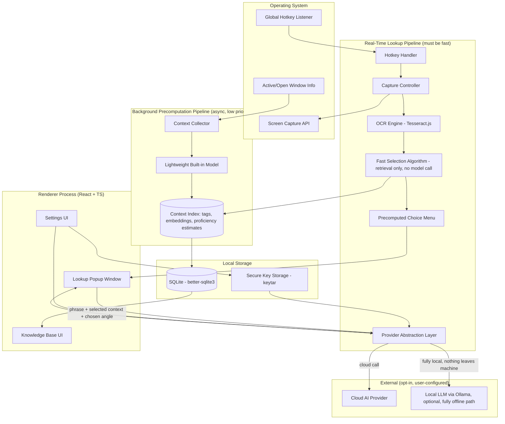
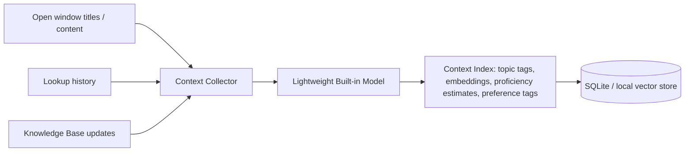
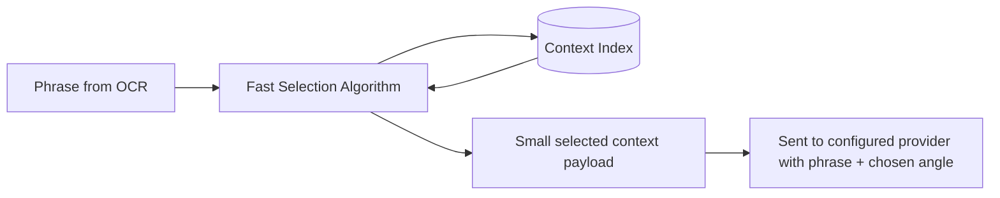

# Delta AI — Project Design Proposal

*A personal planning document to guide development. Last updated: 2026-07-07.*

---

## 1. Vision

Delta AI is a local-first, open-source learning companion. It lets a lifelong
learner point at any word, phrase, or concept on their screen and get an
explanation tuned to what they already know — without sending their data to
anyone but the AI provider they've chosen, and only the minimum needed to
answer the question.

**Core promise to the user:** *"Ask about anything, instantly, and get an
answer that assumes exactly the right amount of background — yours."*

### Design principles (non-negotiable)

1. **Local-first.** All raw data (screenshots, OCR text, history, knowledge
   base) lives on the user's machine. Nothing leaves except a deliberately
   summarized request to the AI provider the user configured.
2. **BYOK, no backend.** No Delta AI server exists. The app talks directly to
   the user's chosen provider (or a fully local model). There is nothing for
   the project maintainers to host, pay for, or be liable for.
3. **Minimize what's sent.** A local small model decides what context is
   actually relevant to a given lookup and compresses it before it's sent
   anywhere external.
4. **Calm, simple UI.** The tool should feel safe and unobtrusive — closer to
   a dictionary than a chat app.
5. **Recursive, not linear.** Explanations can be drilled into indefinitely;
   the tool should never make the user feel "stuck" on a term they don't
   understand.
6. **Fast — Google AI Overview fast.** The lookup interaction must feel
   instant. No local LLM sits in the critical path of a lookup; anything
   slow (understanding the user, understanding their context) happens ahead
   of time in the background, not at the moment they ask.

---

## 2. Feature Breakdown

### 2.1 Look-Up Feature (MVP focus)

- Global hotkey → user selects a screen region.
- OCR extracts the phrase/term (Tesseract.js to start).
- A **fast, non-LLM selection algorithm** pulls already-precomputed context
  about the user (see §3.3) — there is no live summarization step, so this
  is a lookup/retrieval, not a model call, and should be near-instant.
- The user is shown a small set of **quick choices** for what they want
  ("Quick definition," "Explain simply," "How is this used," "Compare to
  something I know," etc.) — these choices come from a fixed, precomputed
  menu, not a model call, so they appear instantly alongside or just before
  the answer. Picking one (or doing nothing, using a sensible default) sends
  the phrase + selected context + chosen angle to the configured AI
  provider.
- Result streams into a lightweight popup window near the cursor.
- Any word/phrase *inside* that explanation can be clicked to recursively
  look itself up, opening a nested or stacked explanation view.
- Every lookup is saved to local history and feeds back into the background
  precomputation pipeline (see §3.3) for future lookups.

### 2.2 Knowledge Base Feature

- Persistent, local, growing profile of the user:
  - Topics/terms they've looked up (with recency/frequency)
  - Inferred current knowledge level per domain
  - Stated or inferred learning preferences (e.g. "prefers analogies,"
    "comfortable with math notation")
- User-facing management UI: view, edit, or delete any stored fact —
  nothing is hidden from the user, and everything is deletable.
- User can see and manage:
  - Which AI provider/model is active for lookups
  - Which local model is active for summarization
  - What's currently in their knowledge base

### 2.3 Proactive Scan / Auto Look-Up

- On demand (not by default — this is a heavier operation), the user can ask
  Delta AI to scan whatever text is currently on screen (via OCR of a larger
  region, or a full-window capture) and flag terms it suspects the user
  doesn't know.
- "Suspects" is decided by fast, local, non-LLM heuristics: term
  rarity/frequency lists, domain classification, and cross-referencing
  against the user's Knowledge Base of already-known terms — not a live
  model judgment call per term, to keep this fast even across a whole page.
- The user reviews the flagged terms (deselecting any they already know) and
  can trigger a batch look-up — ideally batched into as few AI provider
  calls as possible rather than one call per term, both for speed and for
  BYOK cost reasons.
- Results are presented as a list the user can page through, each entry
  expandable into the same popup-style explanation as a normal lookup.

### 2.4 Look and Feel

- Minimal chrome, generous whitespace, restrained color palette (muted,
  low-saturation tones — avoid anything alarm-like: no harsh reds/oranges
  as primary UI colors).
- Motion should be subtle — no bouncy/gamified animations. The emotional
  target is *calm competence*, not delight-through-flourish.
- Popup windows should feel lightweight and dismissible, not modal-heavy.

---

## 3. System Architecture

### 3.1 High-level components

The architecture is split into two pipelines that run at very different
speeds and must not block each other:

- A **background precomputation pipeline** (slow, async, runs on idle/
  schedule) that turns raw context — open windows, lookup history, OCR'd
  text — into small, pre-digested records using a lightweight built-in
  model.
- A **real-time lookup pipeline** (must feel instant) that never calls a
  local LLM. It only *retrieves* already-precomputed records via a fast
  selection algorithm, then makes exactly one call to the user's configured
  AI provider for the actual explanation.



### 3.2 Process boundaries (Electron specifics)

- **Main process** owns: hotkey registration, screen capture, OCR,
  filesystem/SQLite access, secure key storage, and all network calls to AI
  providers. This keeps API keys and raw captured data out of the renderer
  entirely.
- **Renderer process(es)** are pure UI: the lookup popup, the knowledge base
  browser, and settings. They talk to the main process only via IPC
  (`ipcMain`/`ipcRenderer` or `contextBridge`-exposed APIs) — never direct
  filesystem or network access, per Electron security best practice
  (`contextIsolation: true`, `nodeIntegration: false`).
- Each recursive lookup can either reuse the existing popup (stack/breadcrumb
  navigation) or spawn a lightweight child `BrowserWindow` — worth prototyping
  both before committing.

### 3.3 Precomputation & fast selection pipeline

This is the most architecturally sensitive part of the system, since it's
where "local data" eventually turns into "data sent externally" — but it's
also the part responsible for making lookups feel instant, so it's split
into two clearly separate stages that must not be conflated:

**Stage A — Background precomputation (slow, async, off the critical path)**

Runs periodically, on idle, or on a manual "reindex now" trigger — never
during an active lookup. The lightweight built-in model processes
accumulated raw context and writes small, structured records to the Context
Index:



**Stage B — Real-time selection (must be near-instant)**

At the moment of lookup, no model is called for context handling — only
fast retrieval against the already-built Context Index (e.g. embedding
similarity search, tag/keyword matching, or simple rule-based lookups):



Candidate context sources feeding Stage A, roughly in order of
implementation priority:

| Priority | Source | MVP? |
|---|---|---|
| 1 | OCR'd phrase + surrounding OCR'd text (same capture) | Yes |
| 2 | Local Knowledge Base entries relevant to the phrase's domain | Yes |
| 3 | Recent lookup history (last N terms) | Yes |
| 4 | Open/active window titles (and, later, visible content) | v1 |
| 5 | Clipboard content at time of capture | v1 |
| 6 | Broader "open apps" content beyond titles | v2 (needs its own privacy review) |

The **precomputation model's job** is narrow: given accumulated raw context,
output small structured records (e.g. "user is a beginner in X domain,"
"prefers analogy-based explanations," "recently looked up Y and Z") — never
raw transcripts, never full history dumps. The **selection algorithm's job**
at lookup time is purely retrieval — picking which already-summarized
records are relevant to *this* phrase — and should involve no model
inference at all, which is what keeps the real-time path fast.

### 3.4 Provider Abstraction Layer

Both the "cloud AI provider" and "local model for lookups" should sit behind
one interface so providers are swappable without touching calling code:

```ts
interface AIProvider {
  id: string;
  name: string;
  explain(phrase: string, context: SummarizedContext): Promise<Explanation>;
}
```

Planned initial implementations: OpenAI-compatible, Anthropic, and a local
Ollama-backed provider (which also implies zero external network calls if
the user chooses it end-to-end). `explain()` also takes the user's chosen
"angle" (quick definition, simple explanation, comparison, etc.) as a
parameter, so the same interface serves both the normal lookup flow and the
batch-scan flow from §2.3.

### 3.5 Local data model (SQLite, illustrative — not final schema)

- `lookups` — id, phrase, ocr_context, timestamp, explanation, provider_used,
  angle_chosen
- `knowledge_base_entries` — id, topic, inferred_level, source_lookup_id,
  last_updated
- `context_index` — id, source_type (window/history/kb), tag(s), embedding,
  created_at, expires_at — the output of Stage A precomputation; this is
  what Stage B's fast selection algorithm queries against
- `known_terms` — id, term, domain, confidence — used by the Proactive Scan
  feature to decide what to flag vs. skip
- `preferences` — key/value store for learning style, UI settings
- `providers` — configured providers, model names (**not** keys — keys live
  only in OS secure storage, never in SQLite)

---

## 4. Privacy & Security Checklist

- [ ] API keys stored only via `keytar` (or equivalent OS keychain), never in
      SQLite or plaintext config.
- [ ] `contextIsolation: true`, `nodeIntegration: false` on every
      `BrowserWindow`.
- [ ] Renderer never makes network calls directly — everything routes through
      main process's Provider Abstraction Layer.
- [ ] Explicit OS permission prompts for screen capture (and, later,
      accessibility access) — handled gracefully, not silently required.
- [ ] Every field in the Knowledge Base is user-visible and user-deletable.
- [ ] README clearly states, in plain language, exactly what's captured and
      what (if anything) leaves the machine.
- [ ] No telemetry/analytics by default. If ever added, must be explicit
      opt-in.

---

## 5. Tech Stack Summary

| Layer | Choice |
|---|---|
| App shell | Electron + electron-vite |
| UI | React + TypeScript |
| OCR | Tesseract.js (MVP) → evaluate native OS OCR later for accuracy |
| Local storage | SQLite via `better-sqlite3` |
| Key storage | `keytar` |
| Local summarizer model | Small local LLM via Ollama/llama.cpp |
| Cloud AI providers | OpenAI-compatible, Anthropic, others via abstraction layer |
| License | MIT |

---

## 6. Roadmap

**Milestone 0 — Skeleton (done / in progress)**
- electron-vite + React + TS scaffold running.

**Milestone 1 — Core Loop (MVP, no context yet)**
- Hotkey → screen capture → OCR → send phrase directly (no context, no
  angle choice yet) → cloud provider → popup with explanation.
- Basic settings screen: enter API key, pick provider/model.
- Local history table (`lookups`), no KB intelligence yet.
- This alone validates that the real-time path (capture → OCR → API →
  render) is actually fast — worth measuring end-to-end latency here before
  adding anything else.

**Milestone 2 — Choice Menu + Provider Angle Support**
- Add the fixed, precomputed choice menu ("Quick definition," "Explain
  simply," etc.) to the popup.
- Extend `AIProvider.explain()` to accept the chosen angle.
- Still no context/personalization yet — this milestone is purely about the
  interaction shape.

**Milestone 3 — Background Precomputation Pipeline**
- Build the Context Collector + lightweight built-in model integration
  (Stage A). Start with lookup history and Knowledge Base entries as input,
  since those are already-structured local data — defer open-window
  collection to Milestone 5 given its extra privacy surface.
- Write precomputed records to `context_index`.
- Build the Fast Selection Algorithm (Stage B) and wire it into the
  real-time path. Benchmark that this stays fast as `context_index` grows.

**Milestone 4 — Knowledge Base UI**
- Full view/edit/delete UI for KB entries and preferences.
- Provider/model management UI.
- Recursive lookup navigation in the popup.

**Milestone 5 — Open/Active Window Context**
- Add active window title (and, if feasible per-OS, visible content) as a
  Stage A input source. Gate behind its own explicit permission/opt-in given
  its sensitivity.

**Milestone 6 — Proactive Scan / Auto Look-Up**
- Build the `known_terms` heuristic (rarity/frequency + KB cross-reference).
- Batch-scan UI + batched provider calls.

**Milestone 7 — Polish & Open-Source Readiness**
- Visual design pass (calm palette, motion, spacing).
- README, CONTRIBUTING.md, privacy documentation finalized.
- Cross-platform permission handling (macOS Accessibility/Screen Recording,
  Windows equivalents).

**Later / v2 exploration**
- Native OS OCR for better accuracy.
- Local-only mode (Ollama end-to-end, zero external calls, including for the
  precomputation model).
- Broader "open apps" content beyond window titles.

---

## 7. Open Questions (revisit as decisions firm up)

- Popup navigation model for recursive lookups: reuse one window with a
  breadcrumb/stack, or spawn child windows?
- What triggers Stage A (background precomputation) — a timer, idle
  detection, app launch, or a manual "reindex" button? Needs to run often
  enough to stay useful without being a background resource hog.
- What does the Fast Selection Algorithm actually look like — embedding
  similarity search (needs a local vector store), simple tag/keyword
  matching, or a hybrid? This is the piece that most determines whether the
  real-time path actually hits "instant."
- What's the fixed choice-menu set, and does it change per phrase/domain
  (e.g. code terms get different angles than historical terms) or stay
  universal?
- Which lightweight local model is the right default for Stage A
  precomputation (balancing quality vs. requiring a hefty download)?
- How to handle multi-domain knowledge base growth without it becoming noisy
  or stale over time (decay/pruning strategy for `context_index`?).
- For Proactive Scan: what's the right default rarity/frequency threshold
  for flagging a term, and should it be user-tunable from day one?